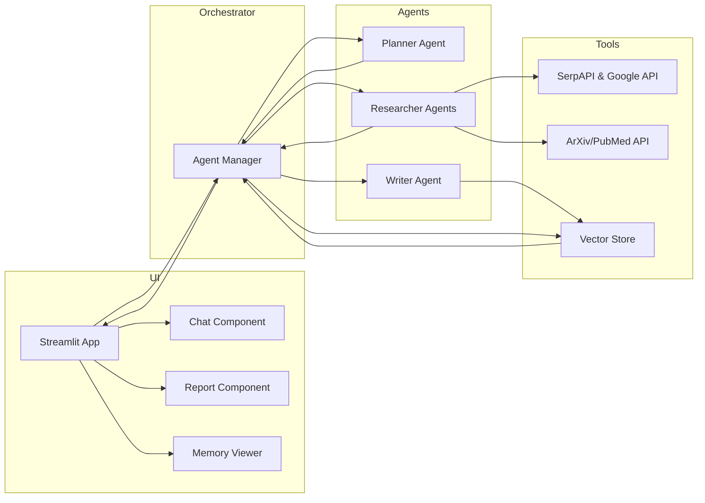

## Product Requirements Document (PRD): Deep Research Agent with Conversational Memory

### 1. Executive Summary

Bu proje, kullanıcıların belirlediği bir konuda derin araştırma (Deep Research) yapan ve konuşma geçmişini (short-term ve long-term memory) koruyarak sonraki etkileşimlerde önceki bağlamı kullanan bir Python tabanlı agent uygulaması geliştirmeyi hedefler. Uygulama, Streamlit tabanlı bir UI sunacak, LangChain/LangGraph ile agent akışını yönetecek ve sonuçları bölüm bölüm raporlayacaktır.

### 2. Hedefler ve Başarı Ölçütleri

- **Derinlemesine Araştırma**: Web ve akademik kaynaklardan çoklu API çağrılarıyla veri topla, analiz et, yapılandırılmış rapor üret.
- **Sohbet Belleği**: Kullanıcı konuşmalarını sakla ve sonraki sorgularda geçmişi referans göster.
- **Düşünce İzleme (Chain-of-Thought)**: Agent her adımdaki karar ve düşünce sürecini kullanıcıya göster.
- **Kullanıcı Dostu UI**: Streamlit arayüzünde soruları al, araştırma süreçlerini ve rapor bölümlerini görüntüle.
- **Performans**: Araştırma adımları asenkron/parallel agent’larla hızlı yürütülsün.

Bol detaylı izleme sayesinde, kullanıcı agent’ın nasıl düşündüğünü izleyerek güven ve şeffaflık kazanır.

### 3. Kapsam

#### 3.1. Dahil Olanlar

- Planner, Researcher, Writer agent modülleri
- Short-Term ve Long-Term Memory entegrasyonu
- Chain-of-Thought logging ve görselleştirme
- Streamlit UI: chat, rapor, memory paneli
- API katmanı: SerpAPI, ArXiv, PubMed vb.
- Vektör depo: Chroma/FAISS/Pinecone

#### 3.2. Hariç Olanlar

- OCR/doküman görüntüden extraction
- Sesli arayüz (TTS/STT)

### 4. Fonksiyonel Gereksinimler

1. **Konu Girişi**: Kullanıcı başlık/metni girer ve araştırma düğmesine basar.
2. **Agent Orkestrasyonu**:
   - **Planner Agent**: Başlığı analiz eder, araştırma planı oluşturur.
   - **Researcher Agents**: Bölüm bölge kaynak taraması ve bilgi toplar.
   - **Writer Agent**: Toplanan veriyi rapor halinde yazar.
3. **Chain-of-Thought Logging**: Her agent adımı için:
   - Girdi prompt’u
   - Araççağrı sonuçları
   - LLM çıktısı
   - Karar/özet Streamlit UI’da kronolojik listelenir.
4. **Short-Term Memory**:
   - Oturum içi son N mesaj tamponu (default N=20).
5. **Long-Term Memory**:
   - Önemli sonuç ve kullanıcı notlarını vektör olarak sakla.
   - Yeniden çağırma için retrieval fonksiyonu.
6. **Chat Penceresi**: Kullanıcı-agent etkileşimi.
7. **Rapor Paneli**: Çıktılar, bölümlere ayrılarak gösterilir.
8. **Memory Paneli**: Kısa ve uzun dönem bellek kayıtları.

### 5. Non-Fonksiyonel Gereksinimler

- **Güvenlik**: API anahtarları güvenli şekilde Config dosyasında.
- **Performans**: Paralel agent işlemleri asenkron.
- **Ölçeklenebilirlik**: Yeni API ve agent eklemeye uygun.
- **Kullanılabilirlik**: Basit, temiz UI; hata yönetimi.

### 6. Sistem Mimarisi



### 7. Chain-of-Thought Görselleştirme

- Her agent çağrısında aşağıdaki JSON formatında log alınacak:

```json
{
  "agent": "Planner",       
  "input_prompt": "...",
  "tool_calls": [{"tool": "SerpAPI", "query": "...", "results": [...] }],
  "llm_response": "...",
  "decision": "Bölüm başlıklarını onayla"
}
```

- Streamlit’da `st.expander` ile her adımı açılabilir listeler halinde göster.

### 8. UI/UX Akış

1. **Başlangıç**: API anahtarları girilir, ayarlar yapılır.
2. **Konu Girişi**: Input alanına metin yaz, `Start Research` tuşu.
3. **Chain-of-Thought Pane**: Sağ panelde agent adımdaki düşünceleri.
4. **Chat Pane**: Kullanıcı veya agent notları.
5. **Report Pane**: Bölümlenmiş rapor otomatik güncellenir.
6. **Memory Pane**: Kısa ve uzun dönem verileri listeler.

### 9. Proje Yapısı

```
deep_research_agent/
├── README.md
├── requirements.txt
├── .env                # API key’ler
├── streamlit_app.py    # UI giriş noktası
├── orchestrator/
│   ├── manager.py      # Agent akışını yönetir
│   ├── planner.py
│   ├── researcher.py
│   └── writer.py
├── memory/
│   ├── short_term.py   # Buffer/trim/summary
│   └── long_term.py    # VectorStore bağlantısı
├── tools/
│   ├── web_search.py   # SerpAPI wrapper
│   └── acad_search.py  # ArXiv/PubMed
├── logs/
│   └── chain_of_thought.json
└── utils/
    ├── config.py
    └── prompts.py      # Prompt şablonları
```

### 10. Zaman Çizelgesi (Örnek)

- **1-2 Hafta**: Temel agent akışı + UI skeleton
- **3. Hafta**: Logging & memory entegrasyonu
- **4. Hafta**: Chain-of-Thought görselleştirme & styling
- **5. Hafta**: Test & dokümantasyon
- **6. Hafta**: Dağıtım & performans optimizasyonu

---

Bu PRD taslağı, projenin tüm kritik bileşenlerini, akışını ve geliştirme adımlarını kapsamaktadır. İstersen detaylara yönelik revizyon veya ek gereksinim ekleyebiliriz.

